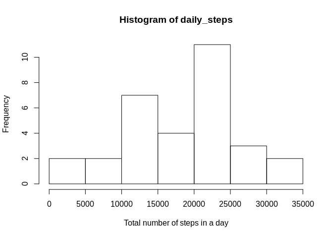
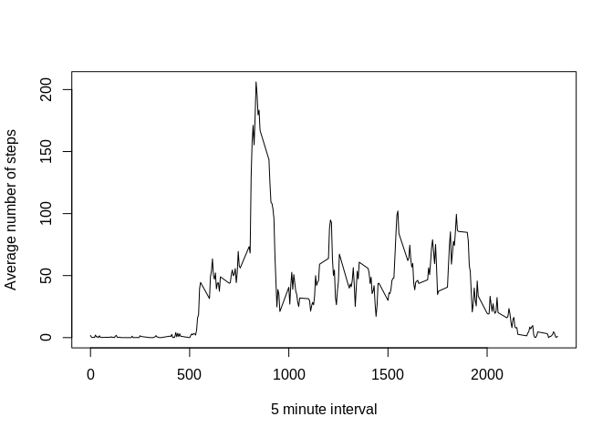
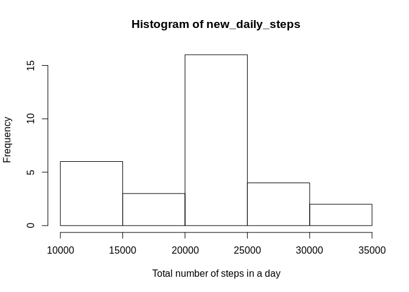
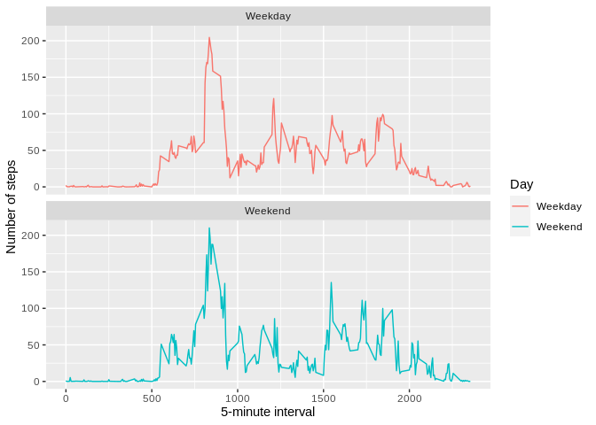

### Loading and preprocessing the data


```r
activity <- read.csv("activity.csv")
activity$date <- as.Date(activity$date,format="%Y-%M-%d")
```
### What is mean and median total number of steps taken per day?

```r
daily_steps <- tapply(activity$steps,activity$date,sum,na.rm=TRUE)
mean_steps <- mean(daily_steps,na.rm=TRUE)
median_steps <- median(daily_steps,na.rm=TRUE)
```
The mean number of steps in a day is 1.840671\times 10^{4} and median of the total number of steps in a day is 20525.
Following is a histogram of the total number of steps in a day.

```r
hist(daily_steps,xlab="Total number of steps in a day")
```

<!-- -->

### What is the average daily activity pattern?

Following is the time series plot of the average number of steps (averaged across each day) in each 5-minute interval.

```r
avg_interval <- tapply(activity$steps,activity$interval,mean,na.rm=TRUE)
plot(names(avg_interval),avg_interval,type="l",xlab="5 minute interval",ylab="Average number of steps")
```

<!-- -->


```r
m <- max(avg_interval,na.rm=TRUE)
i <- which(avg_interval==m) # index of the maximum value of average steps
max_interval <- names(avg_interval)[i] # interval with maximum number of average steps
```
The 5-minute interval with the maximum number of steps on average is the 835 interval.

### Imputing missing values
The missing values were filled with the mean value of steps for the corresponding 5 minute interval averaged across the days.

```r
na_num <- sum(is.na(activity$steps))
na_index <- which(is.na(activity$steps))
activity$new_steps <- activity$steps
for (i in na_index)
{
  activity[i,"new_steps"] <- avg_interval[[as.character(activity[i,"interval"])]]
}
new_daily_steps <- tapply(activity$new_steps,activity$date,sum,na.rm=TRUE)
```
Following is the histogram after filling the missing values.

```r
hist(new_daily_steps,xlab="Total number of steps in a day")
```

<!-- -->


```r
new_mean_steps <- mean(new_daily_steps)
new_median_steps <- median(new_daily_steps)
```
The average of total steps in a day in the new dataset (after imputing missing values) is 2.1185081\times 10^{4} and the median is 2.1641\times 10^{4}.
Both values are higher than the estimates calculated before imputing the missing values.

### Are there differences in activity patterns between weekdays and weekends?
Following is the comparison of activity patterns on weekdays and weekends.

```r
library(dplyr)
```

```
## 
## Attaching package: 'dplyr'
```

```
## The following objects are masked from 'package:stats':
## 
##     filter, lag
```

```
## The following objects are masked from 'package:base':
## 
##     intersect, setdiff, setequal, union
```

```r
activity <- mutate(activity,day=ifelse(weekdays(date)=="Saturday"|weekdays(date)=="Sunday","Weekend","Weekday"))
avg_weekday <- tapply(activity$new_steps,list(activity$interval,activity$day),mean)
par(mfrow=c(2,1),mar=c(4,2,2,1))
plot(as.numeric(rownames(avg_weekday)),avg_weekday[,"Weekend"],type="l",xlab="5-minute interval",ylab="Number of steps",main="Weekend")
plot(as.numeric(rownames(avg_weekday)),avg_weekday[,"Weekday"],type="l",xlab="5-minute interval",ylab="Number of steps",main="Weekday")
```

<!-- -->
